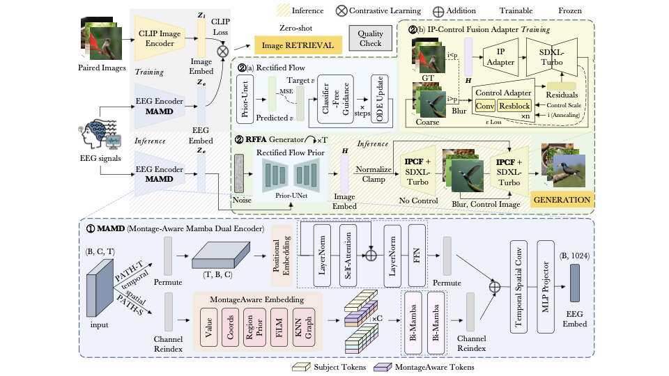
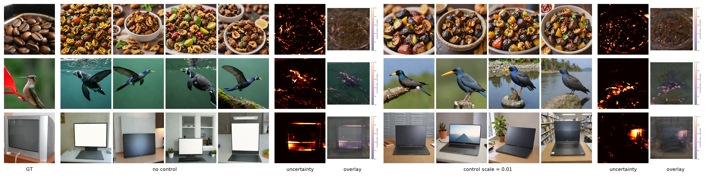

<div align="center">

<h2 style="border-bottom: 1px solid lightgray;">EEGRFusion</h2>

<p align="center">
  
  
  
  
</p>

</div>

EEGRFusion is an EEG-based visual decoding framework for image retrieval and image reconstruction. It combines **MAMD** for montage-aware temporal EEG representation learning with **RFFA**, a rectified-flow and IP-Control fusion adapter generator for reconstructing visual stimuli from EEG embeddings.

<p align="center">
  
</p>

<p align="center">
  
</p>

---

## Highlights

- Montage-aware temporal EEG encoding for retrieval and reconstruction.
- RFFA generation pipeline with rectified-flow prior and IP-Control fusion-adapter guidance.
- Retrieval baselines and reconstruction metrics for comparison.
- Visualization notebooks for generation examples and quantitative evaluation.

---

## Key Files

- `Retrieval/MAMD_retrieval.py` - train and evaluate the MAMD retrieval model.
- `Retrieval/retrieval_baselines_metrics.py` - evaluate retrieval baseline encoders.
- `Generation/MAMD_reconstruction.py` - train the reconstruction model.
- `Generation/Generation_metrics_sub8_EEGRFusion.ipynb` - run RFFA generation and visualization.
- `Generation/Reconstruction_Metrics_EEGRFusion.ipynb` - compute reconstruction metrics.

---

## Environment Setup

You can set up the environment with `setup.sh`:

```bash
bash setup.sh
```

Or create the conda environment from `environment.yml`:

```bash
conda env create -f environment.yml
conda activate eegrfusion
```

---

## Quick Start

Train and evaluate MAMD retrieval:

```bash
cd Retrieval
python MAMD_retrieval.py --logger True --gpu cuda:0
```

Run retrieval baselines:

```bash
cd Retrieval
python retrieval_baselines_metrics.py --encoder_type EEGNex --epochs 30 --batch_size 64
```

Train the reconstruction model:

```bash
cd Generation
python MAMD_reconstruction.py --insubject True --subjects sub-08 --logger True --gpu cuda:0
```

Run generation and evaluation with:

```text
Generation/Generation_metrics_sub8_EEGRFusion.ipynb
Generation/Reconstruction_Metrics_EEGRFusion.ipynb
```

---

## Data Availability

This project inherits the dataset setup from [ncclab-sustech/EEG_Image_decode](https://github.com/ncclab-sustech/EEG_Image_decode). Please refer to that repository for data access and organization.

---

## Acknowledgement

This project is built on the baseline work:

**Visual Decoding and Reconstruction via EEG Embeddings with Guided Diffusion**  
Dongyang Li, Chen Wei, Shiying Li, Jiachen Zou, and Quanying Liu. NeurIPS 2024.  
Paper: https://arxiv.org/abs/2403.07721

```bibtex
@inproceedings{li2024visual,
 author = {Li, Dongyang and Wei, Chen and Li, Shiying and Zou, Jiachen and Liu, Quanying},
 booktitle = {Advances in Neural Information Processing Systems},
 editor = {A. Globerson and L. Mackey and D. Belgrave and A. Fan and U. Paquet and J. Tomczak and C. Zhang},
 pages = {102822--102864},
 publisher = {Curran Associates, Inc.},
 title = {Visual Decoding and Reconstruction via EEG Embeddings with Guided Diffusion},
 url = {https://proceedings.neurips.cc/paper_files/paper/2024/file/ba5f1233efa77787ff9ec015877dbd1f-Paper-Conference.pdf},
 volume = {37},
 year = {2024}
}
```
